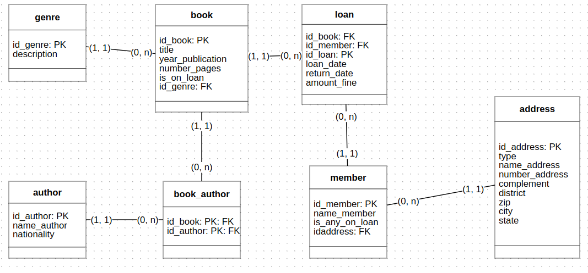

# Library Manager

- Projeto de conclusão do módulo Programação Web II, do curso Ser Mais Tech Programa 50+, 
uma parceria da ADA TECH e Núclea.

Integrantes em ordem alfabética:

    - Carlos Cesar - @Cesarev3
    - Fábio - @fkamag
    - Oliver - @OliRamos
    - Patricia - @Patycrazier

### Requisitos do projeto:
Sistema de biblioteca:

- Gestão de Livros

Must have

Criar, visualizar, atualizar e deletar (CRUD) livros.
Informações de um livro podem incluir mas não se limitam à: título, autor, ano de publicação, ISBN...

Gestão de Membros

Criar, visualizar, atualizar e deletar (CRUD) membros.
Informações de um membro podem incluir mas não se limitam à nome, endereço, contato...

Nice to have

- Gestão de Empréstimos

Registrar empréstimos de livros aos membros.

Definir prazo para devolução e gerenciar multas por atraso.

## Tecnologias utilizadas:
- Java 17
- Spring Boot
- Spring Web
- JPA
- PosgresSQL

## Modelagem do Banco de Dados

